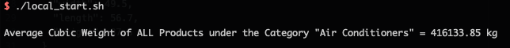
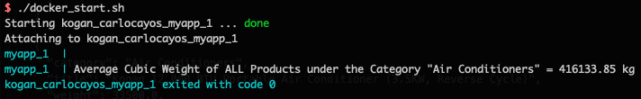

# Kogan Coding Challenge

**Applicant:** Carlo Cayos

**Language:** Go

# Getting Started
There are two ways to build and run the application. Helper scripts were created for both options.

First is building the binary locally and storing it in `bin` folder, this requires Go is installed locally.
 
Second is building a Docker image and running via Docker compose.

## Build using Go
1. Download and Install Go
2. Run `local_build.sh` to build the application and save the binary in `bin`
3. Run `local_start.sh` to run the application
4. Sample result below



## Build using Docker
1. Install Docker and Docker Compose
2. Run `docker_build.sh` to download the required Docker images and build the application
4. A Docker image is saved with tag `kogan_carlocayos`
5. Run `docker_start.sh`. This requires Docker Compose installed
6. Sample result below



# Passing Arguments
The helper scripts use the default value `conf/config.properties` and `Air Conditioners` for category filter. 
The program is configurable and accepts two arguments in this format:

```shell script
myapp <config-file> <[OPTIONAL] category-filter>

  config-file       path to the config properties file. See conf/config.properties
  category-filter   [OPTIONAL] the product category filter to compute the average cubic weight. If not defined the default value is "Air Conditioners"  
```

Example filtering products with specified category.
```shell script
./bin/myapp conf/config.properties "Air Conditioners"
  Average Cubic Weight of ALL Products under the Category "Air Conditioners" = 416133.85 kg

./bin/myapp conf/config.properties "Gadgets"
  Average Cubic Weight of ALL Products under the Category "Gadgets" = 487.50 kg
```


